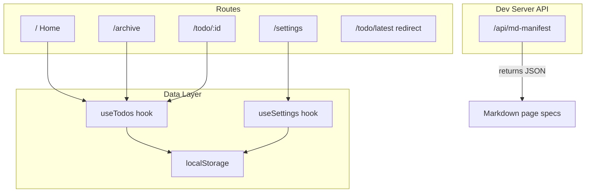

# Todo App Transformation

## Current State

The project is a vanilla **Vite 8 + React 19 + TypeScript** starter with no router, one component (`[src/App.tsx](src/App.tsx)`), and plain CSS (`[src/index.css](src/index.css)`, `[src/App.css](src/App.css)`). We will replace essentially all of it.

## Architecture




## 1. Dependencies

Install `react-router-dom` (client-side routing). No other runtime deps needed -- localStorage is native and markdown specs are static strings.

## 2. Data Model and Storage

Create `src/lib/store.ts` with:

```typescript
type TodoStatus = 'todo' | 'in-progress' | 'completed' | 'archived';

interface Todo {
  id: string;
  name: string;
  description: string;
  status: TodoStatus;
  dueDate: string; // ISO date string
  createdAt: string;
}
```

- `**useTodos()**` custom hook -- reads/writes `todos` key in localStorage, returns CRUD helpers (`addTodo`, `updateTodo`, `deleteTodo`, `archiveTodo`), memoized filtering by status.
- `**useSettings()**` custom hook -- reads/writes `settings` key, manages `{ name: string }` (default `"John Doe"`).
- Seed 4 default todos on first load (one per status) with realistic names, descriptions, and due dates.

## 3. Routing

Use `react-router-dom` with a `<BrowserRouter>` wrapping a shared `<Layout>` component:


| Route          | Component        | Notes                                                                   |
| -------------- | ---------------- | ----------------------------------------------------------------------- |
| `/`            | `HomePage`       | Header greeting user by name + filtered todo list (excludes archived)   |
| `/settings`    | `SettingsPage`   | Name input field                                                        |
| `/archive`     | `ArchivePage`    | Lists only archived todos                                               |
| `/todo/latest` | Redirect         | Resolves to the most recently created todo and navigates to `/todo/:id` |
| `/todo/:id`    | `TodoDetailPage` | Full detail view with name, description, status, due date; editable     |


### File structure under `src/`:

```
src/
  main.tsx
  App.tsx              -- BrowserRouter + Routes
  index.css            -- Global CRT styles
  lib/
    store.ts           -- Todo and Settings hooks + types + defaults
    manifest.ts        -- Markdown spec definitions (imported by both API and optionally client)
  components/
    Layout.tsx         -- Shell: header nav + CRT overlay + outlet
    TodoList.tsx       -- Renders a list of TodoItem cards
    TodoItem.tsx       -- Single todo row/card with status indicator
  pages/
    HomePage.tsx
    SettingsPage.tsx
    ArchivePage.tsx
    TodoDetailPage.tsx
```

## 4. Markdown Manifest API

Add a Vite dev server middleware plugin in `[vite.config.ts](vite.config.ts)` that intercepts `GET /api/md-manifest` and returns a JSON response. The markdown definitions live in `src/lib/manifest.ts` so they can be imported by the plugin at dev time.

Response shape:

```json
[
  {
    "url": "/",
    "exampleUrl": "/",
    "title": "Home",
    "description": "Main todo list dashboard",
    "spec": "# Home\n\n..."
  },
  {
    "url": "/todo/:id",
    "exampleUrl": "/todo/latest",
    "title": "Todo Detail",
    "description": "Shows details about a todo item",
    "spec": "# Todo Detail\n\n..."
  }
]
```

Each `spec` will follow the user's markdown DSL guidelines:

- Non-technical descriptions of each section
- Edge cases and behavior documented
- Colors mentioned and **bolded** where editable
- Business logic **bolded**
- Components and design patterns in *italics*

## 5. Visual Design -- CRT Terminal Aesthetic (Dark Mode)

Inspired by the SYSOP reference image, inverted to dark mode:

- **Background**: Near-black (`#0a0a0a`) with subtle green/amber phosphor glow
- **Text**: Terminal green (`#33ff33`) or amber (`#ffb000`) as primary, with dimmer secondary text
- **Font**: Google Fonts `"VT323"` (pixelated terminal) for headings, `"IBM Plex Mono"` or `"Share Tech Mono"` for body -- both monospaced
- **CRT overlay**: A pseudo-element on the root with repeating scanline gradient + slight flicker animation, plus a subtle vignette border shadow
- **Borders**: 1px solid terminal-green, sharp corners (no border-radius), double-border or dashed for section separation
- **Status indicators**: Block characters or filled rectangles color-coded per status:
  - `todo` = **dim gray**
  - `in-progress` = **amber/yellow**
  - `completed` = **green**
  - `archived` = **dark muted**
- **Buttons/inputs**: Monospaced, bordered, no background fill -- terminal prompt style with blinking cursor effect on focus
- **Header**: Large block/pixel title (VT323), session info bar reminiscent of the SYSOP reference
- **Navigation**: Horizontal tab-bar with `[ BRACKETED ]` labels, active tab highlighted
- **Hover states**: Inverse color (green bg, black text) or glow effect
- **Animations**: Subtle text flicker, scanline drift, typing cursor blink

All styles in plain CSS with CSS custom properties for theming consistency. No Tailwind.

## 6. Markdown Content for Each Page

Write rich markdown specs for all 4 page routes following the DSL:

1. **Home** (`/`) -- Describes header section, greeting, todo list with status filters, how todos appear, what clicking a todo does, empty states
2. **Settings** (`/settings`) -- Describes name input, save behavior, default value, validation
3. **Archive** (`/archive`) -- Describes the archived items list, how items get here, restore behavior
4. **Todo Detail** (`/todo/:id`) -- Describes all fields, edit behavior, status transitions, the `/todo/latest` shortcut, back navigation

